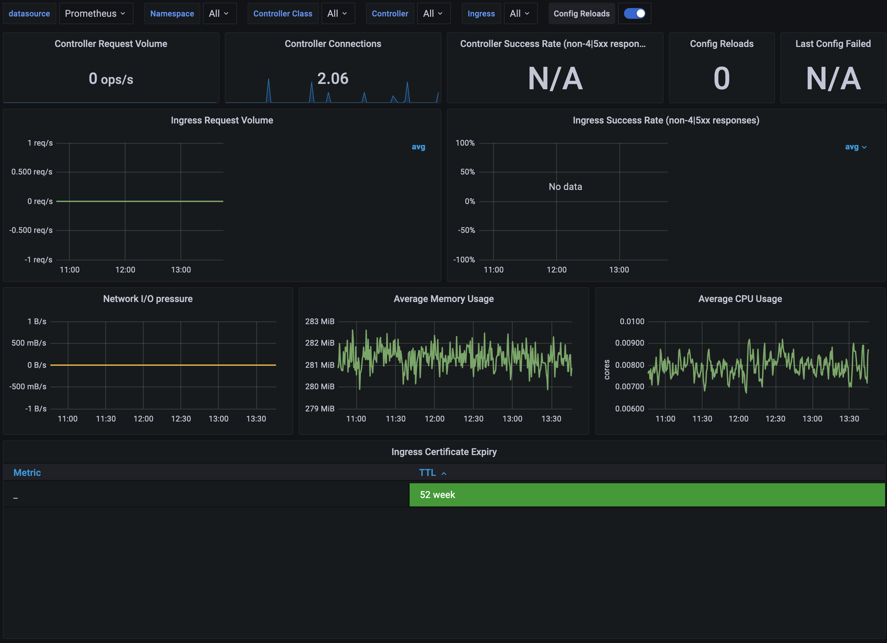

## Introduction

Akash Network is a decentralized cloud marketplace where tenants purchase cloud-grade compute in an open permissionless manner.
The decentralized cloud is a shift from computing resources being owned and operated mostly by the three large Cloud companies (Amazon, Google, and Microsoft) to a decentralized network of *Cloud Providers* running open source software developed by a community and creating competition in an open marketplace with more **providers**.

**Providers** provide compute resources to the network leveraging technologies such as Kubernetes, Docker and NGINX. One of the core components of these **providers** is the *NGINX Ingress Controller*.
The *NGINX Ingress Controller* is an application that runs in a cluster and configures an HTTP load balancer according to Ingress resources. It is the entry point of all incoming traffic to the provider.

In this blogpost I'll walk you through the process of enabling metrics on your *Akash Ingress Controller* (w).

## Pre-requisites
* A working Akash Provider
* `helm`
* `kubectl`

## Enabling metrics

Before starting let's make sure we have the latest version of the `akash/akash-ingress` helm chart. To check run:
```bash
helm show chart akash/akash-ingress
```
If you have a version >=1.2.6 you are all set. If not make sure to update to the latest version by running `helm repo update akash`.

### Upgrade the Ingress Controller

Now that you have the latest version of the helm chart its time to upgrade your existing one and enabling metrics. To do this, run:
```bash
helm upgrade akash-ingress akash/akash-ingress -n ingress-nginx --set controller.metrics.enabled=true \
--set-string controller.podAnnotations."prometheus\.io/scrape"="true" \
--set-string controller.podAnnotations."prometheus\.io/port"="10254"
```
Depending on your rollout strategy and cluster setup this may impact your uptime.
**Make sure to take apropriate actions to avoid provider downtime.**

### Installing Prometheus

To install Prometheus in your provider cluster simply run:
```bash
kubectl apply --kustomize github.com/kubernetes/ingress-nginx/deploy/prometheus/
```
This will deploy Prometheus in your cluster. Make sure everything is running properly.

### Installing Grafana

Similar to Prometheys you can deploy Grafana in your cluster by running:
```bash
kubectl apply --kustomize github.com/kubernetes/ingress-nginx/deploy/grafana/
```

Access the newly deployed Grafana by port forwarding to it. You can use `kubectl` for this.
```bash
kubectl port-forward svc/grafana 3000:3000 -n ingress-nginx
```
Next open your browser and go to `localhost:3000`. The default user and password are both **admin**

### Creating the dashboards

Before you create the dashboard you need to connect to the Prometheus server.
To do this in Grafana hover on the gearwheel icon for Configuration and click "Data Sources".
You can then click on "Add data source", select "Prometheus" and enter the host `http://PROMETHEUS_IP:9090`.
You can get `PROMETHEUS_IP` by running:
```bash
kubectl get svc -n ingress-nginx
```
Which will print something similar to:
```
NAME                                 TYPE        CLUSTER-IP      EXTERNAL-IP   PORT(S)                                                         AGE
prometheus-server                    NodePort    10.43.104.200   <none>        9090:30197/TCP                                                  13d
grafana                              NodePort    10.43.197.148   <none>        3000:31305/TCP                                                  13d
ingress-nginx-controller             ClusterIP   10.43.192.72    <none>        80/TCP,443/TCP,8443/TCP,1317/TCP,9090/TCP,26656/TCP,26657/TCP   17d
ingress-nginx-controller-metrics     ClusterIP   10.43.175.35    <none>        10254/TCP                                                       8h
ingress-nginx-controller-admission   ClusterIP   10.43.68.255    <none>        443/TCP                                                         17d
```
The `PROMETHEUS_IP` is the `CLUSTER-IP` assigned to the `prometheus-server` service.
After creating the data source you can start creating your dashboards.

You can download a dashboard for your exported metrics [here](https://raw.githubusercontent.com/kubernetes/ingress-nginx/main/deploy/grafana/dashboards/nginx.json). Simply copy and import the JSON into grafana.

You should have a dashboard similar to the one below.


## Conclusion

Now you have an Akash Provider with observability enabled which will allow you to monitor your provider's KPIs.
The next steps will be up to you.
Whether you want to create new dashboards that leverage the metrics exported by the NGINX Ingress Controller, whether you want to export some custom metrics in your cluster's services or simply enhance the ones I provided in this post.

Remember that effective monitoring of clusters makes it easier to manage your containerized infrastructure, by tracking uptime, utilization of cluster resources (such as memory, CPU, storage and network trafic), and interaction between cluster components.